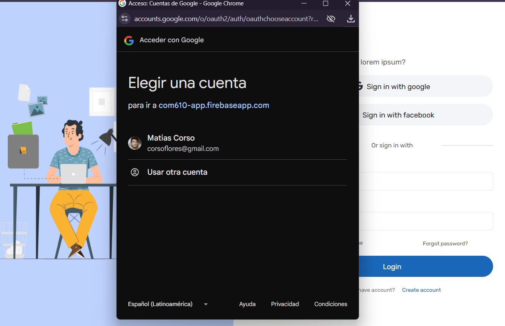
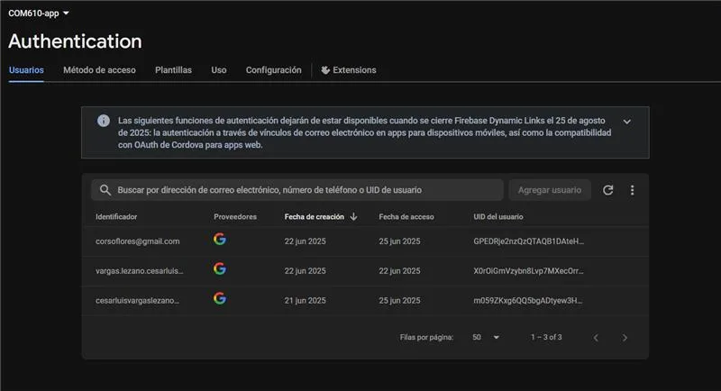
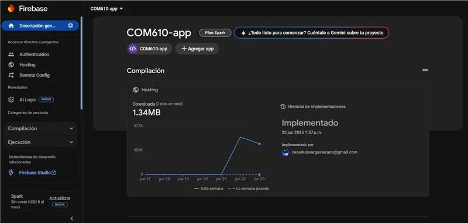
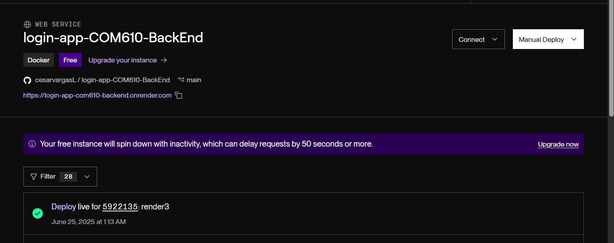
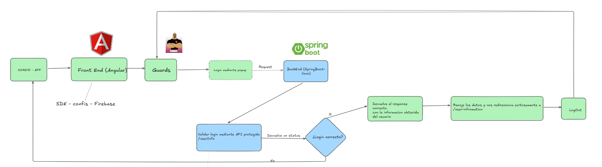

# Proyecto Final: Implementación de Autenticación OAuth2 con Firebase (Google y Facebook)

## Objetivo General

Diseñar e implementar una aplicación web que gestione la autenticación de usuarios utilizando **Firebase Authentication**, permitiendo el inicio de sesión con cuentas de **Google** y **Facebook**, demostrando el manejo seguro de sesiones y la visualización de información del usuario autenticado.

---

## 🧾 Descripción del Proyecto

Esta aplicación web requiere autenticación para acceder a su funcionalidad principal. Los usuarios pueden registrarse o iniciar sesión mediante **Google Sign-In** o **Facebook Login**. Una vez autenticados, se les redirige a un **Panel de Control** donde se muestra información básica del perfil como:

- Burlecot Matias Corso Flores
- Cesar Luis Vargas Lezano

También incluye funcionalidad para **cerrar sesión de manera segura**.

## 💻 Tecnologías Utilizadas

- **Frontend**: Angular y typescript
  -**BackEnd**:Java y Maven
- **Autenticación**: Firebase Authentication
- **Proveedores OAuth2**: Google, Facebook
- **Despliegue**: Firebase Hosting / Render
## Requisitos Técnicos (Core):
Los siguientes requisitos son obligatorios para todos los grupos:
1. Aplicación Frontend:
   ○ Una aplicación web de Frontend que sirva como interfaz de usuario.
   ○ Desarrollada con Angular y Typescript .
   

2. Servicio de Autenticación:
   ○ Utilizar Firebase Authentication como el servicio de autenticación backend.
   ○ Configurar y habilitar los proveedores de identidad Google Sign-In y Facebook
   Login en la consola de Firebase.
   
3. Flujo de Autenticación OAuth2�
   ○ Implementar el flujo de inicio de sesión y registro de usuarios para ambos
   proveedores (Google y Facebook) desde el Frontend.
   ○ La aplicación debe ser capaz de detectar si un usuario ya está autenticado
   (mantener la sesión) y manejar las redirecciones o el acceso a rutas protegidas.
   ○ Implementar la funcionalidad de cierre de sesión.
   
4. Página de Perfil/Dashboard:
   ○ Una página o sección de la aplicación accesible solo para usuarios autenticados.
   ○ Esta página debe mostrar al menos el nombre de usuario, el correo electrónico y la
   foto de perfil del usuario, obtenidos del objeto de usuario de Firebase.
   
5. Configuración de Firebase:
   ○ Correcta inicialización del SDK de Firebase en el Frontend con las credenciales de
   su proyecto de Firebase.
   ○ Utilizar variables de entorno (ej. para las claves de API de Firebase) en el proceso
   de build del Frontend para mantener las credenciales fuera del código fuente
   directamente.

6. Despliegue en la Nube:
   ○ La aplicación Frontend debe ser desplegada en una plataforma de hosting estático
   o de contenedores de bajo costo/nivel gratuito.
   ○ Opciones preferentes: Firebase Hosting (la más natural para Firebase) o cualquier
   plataforma que acepte Frontend estáticos (ej. Netlify, Vercel). Alternativamente,
   pueden contenerizar el Frontend y desplegarlo (ej. con un Nginx en un contenedor)
   en plataformas como Render.com o Railway.app.
   
## Requisitos Técnicos (Opcionales / Puntos Extra):
Los grupos que deseen ir más allá y obtener una calificación superior pueden considerar lo
siguiente:
● Backend con API Protegida:
○ Implementar un Backend (ej. Node.js/Express, Python/Flask) que exponga una API.
○ Proteger esta API de modo que solo los usuarios autenticados por Firebase
puedan acceder a ella, verificando el token de ID de Firebase en el Backend.

Usamos render para el despliegue del backend
